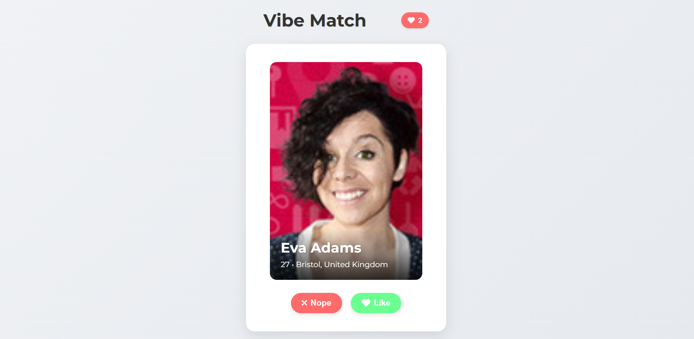
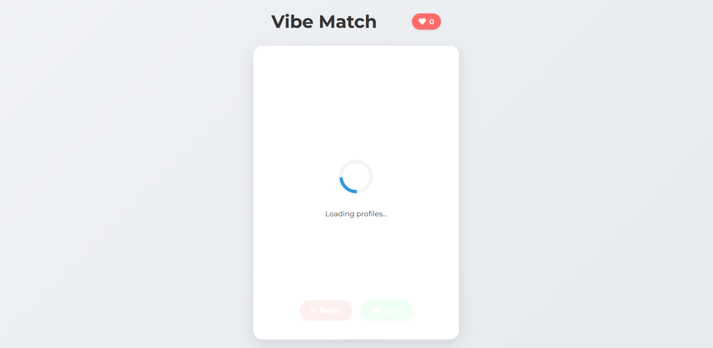
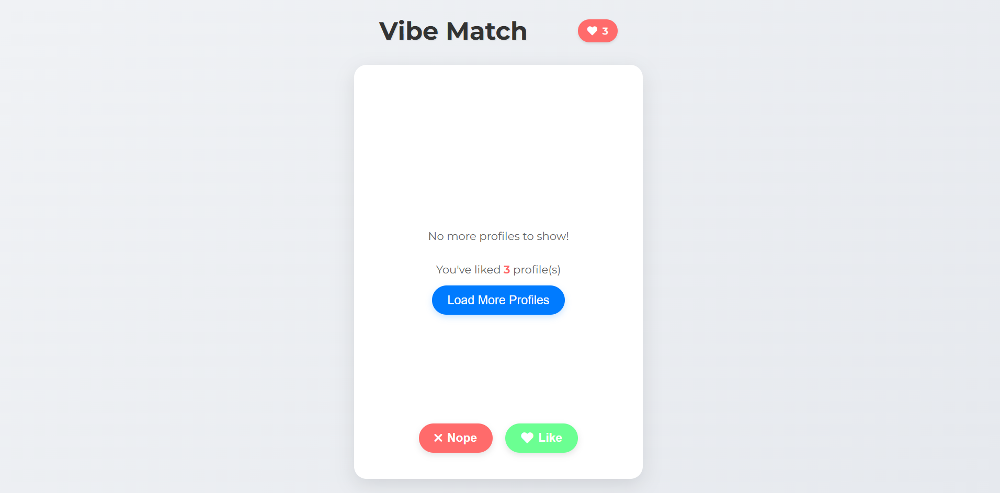

# Vibe Match 💖

---

## 🚀 Project Overview

**Vibe Match** is a lightweight, interactive web application that simulates a modern dating/matching platform. Built purely with **HTML, CSS, and JavaScript**, it demonstrates fundamental front-end development skills including dynamic DOM manipulation, asynchronous data fetching, and engaging UI/UX design. Users can "Like" or "Nope" profiles, mimicking the popular swipe-based interaction, with profiles fetched from the [Random User API](https://randomuser.me/).

This project highlights my ability to create responsive, user-friendly interfaces and manage application state in vanilla JavaScript, making it a strong showcase for front-end development roles.

---

## ✨ Features

* **Dynamic Profile Cards:** Displays user profiles with names, ages, cities, and countries, fetched from an external API.
* **Intuitive "Swipe" Interactions:** Smooth CSS animations for "Like" (swipe right) and "Nope" (swipe left) actions, enhancing user engagement.
* **Asynchronous Data Fetching:** Efficiently loads new profiles using `fetch` API, ensuring a continuous stream of content.
* **Responsive Design:** Adapts gracefully to various screen sizes (mobile, tablet, desktop) for a consistent user experience.
* **Loading Indicator:** Provides clear visual feedback to the user while new profiles are being loaded, improving perceived performance.
* **Liked Profiles Counter:** A real-time counter displays the number of profiles the user has liked, offering immediate feedback.
* **"No More Profiles" State:** Thoughtfully handles the end of the current profile list, offering a clear message and an option to reload more profiles.
* **Clean & Modular Codebase:** Organized HTML, CSS, and JavaScript files for readability, maintainability, and scalability.

---

## 🛠️ Technologies Used

* **HTML5:** For structuring the web content.
* **CSS3:** For styling the application, including responsive layouts and animations.
* **JavaScript (ES6+):** For all dynamic functionality, API interactions, and DOM manipulation.
* **Font Awesome:** Integrated for modern and scalable icons (e.g., heart, cross, spinner).

---

## 🌐 Live Demo

Experience Vibe Match live in your browser:

👉 **[https://avanishshaw.github.io/vibe-match/](https://avanishshaw.github.io/vibe-match/)** 👈

---

## 📸 Screenshots

**1. Main Profile View:**
A typical profile card displayed with user information and action buttons.


**2. Loading State:**
The loading spinner visible while new profiles are being fetched.


**3. No More Profiles:**
The message displayed when all current profiles have been reviewed, with the "Load More" button.


---

## 🚀 How to Run Locally

To get a local copy of Vibe Match up and running on your machine, follow these simple steps:

1.  **Clone the repository:**
    ```bash
    git clone [https://github.com/avanishshaw/vibe-match.git](https://github.com/avanishshaw/vibe-match.git)
    ```
2.  **Navigate to the project directory:**
    ```bash
    cd vibe-match
    ```
3.  **Open `index.html`:**
    Simply open the `index.html` file in your preferred web browser (e.g., by double-clicking it or dragging it into the browser window).

---

## 🤝 Contributing

Contributions are what make the open-source community such an amazing place to learn, inspire, and create. Any contributions you make are **greatly appreciated**.

If you have a suggestion that would make this better, please fork the repo and create a pull request. You can also simply open an issue with the tag "enhancement".

1.  Fork the Project
2.  Create your Feature Branch (`git checkout -b feature/AmazingFeature`)
3.  Commit your Changes (`git commit -m 'Add some AmazingFeature'`)
4.  Push to the Branch (`git push origin feature/AmazingFeature`)
5.  Open a Pull Request

---

## 📄 License

Distributed under the MIT License. See the `LICENSE` file for more information. *(Note: You can add a simple `LICENSE` file in your repo if you wish, containing the MIT license text. For a personal portfolio project, it's optional but good practice.)*

---

## 📧 Contact

**Avanish Kumar** - [shawavanish@gmail.com](mailto:shawavanish@gmail.com)

**Project Link:** [https://github.com/avanishshaw/vibe-match](https://github.com/avanishshaw/vibe-match)
**LinkedIn:** [My LinkedIn Profile](https://www.linkedin.com/in/avanish-shaw/)

---